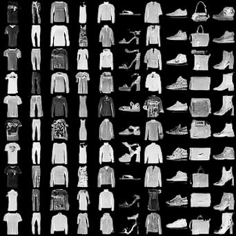
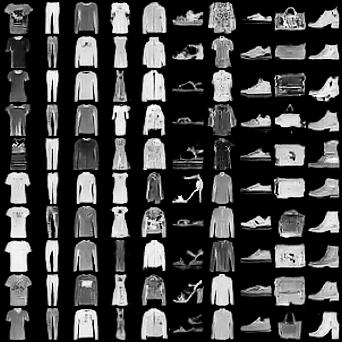
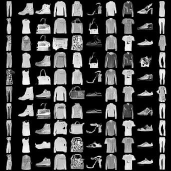
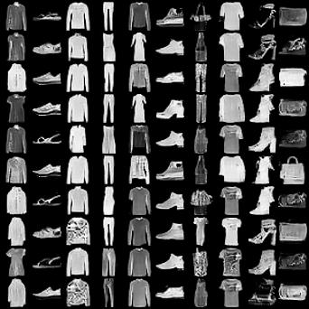
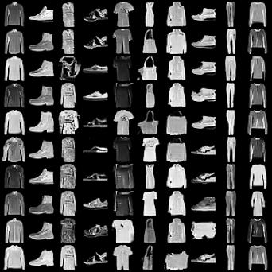

# <p align="center"> Conditional GANs </p>

Pytorch implementation of several GANs with conditional signals (supervised or unsupervised). All experiments are conducted on [Fashion-MNIST](https://github.com/zalandoresearch/fashion-mnist), and the network structures are adapted from [Improved GAN](https://arxiv.org/abs/1606.03498).

## Conditional GANs

- [x] [CGAN](http://arxiv.org/abs/1411.1784)
- [ ] [CGAN with Projection Discriminator](http://arxiv.org/abs/1802.05637)
- [x] [ACGAN](http://arxiv.org/abs/1610.09585)
- [x] [InfoGAN](http://arxiv.org/abs/1606.03657)
- [ ] Others

## Exemplar Results

CGAN                            | ACGAN                           | InfoGAN1
:---:                           | :---:                           | :---:
     |     | 
**InfoGAN2**                    | **InfoGAN3**                    | **-**
 |  | -

## Usage

- Prerequisites
    - PyTorch 1.0.0
    - Python 3.6

- Examples of training
    - training

        ```console
        CUDA_VISIBLE_DEVICES=0 python train_CGAN.py
        ```

    - tensorboard for loss visualization

        ```console
        CUDA_VISIBLE_DEVICES='' tensorboard --logdir ./output/CGAN_default/summaries --port 6006
        ```
